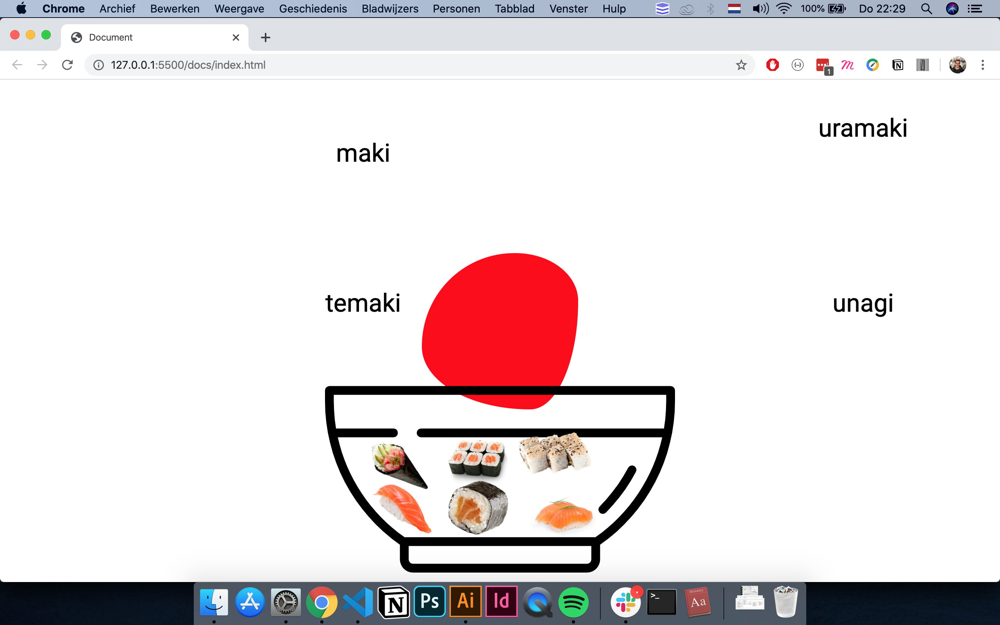

# 🎓 CSS To The Rescue 👨🏻‍💻 Marten de Bruijn

## Live Demo

[Bekijk de live demo!](https://martendebruijn.github.io/css-to-the-rescue-1920/)

###### Light mode



###### Dark mode


## Description

Deze repo is een interactieve menukaart met de bedoeling om zo veel mogelijk CSS elementen te leren.

## Keuze Opdracht

##### Choose one asignment

Responsive restauraunt menu

##### Context (You have to add at least one extra context to your site)

Dark-mode

##### Pick two restrictions You have to work with at least two of these restrictions.

- When SVG meets CSS: Shapes / Masks / SVG
- Responsive without media queries

##### The Selector First CSS Methodology

Om de 'the selector first CSS methodology' toe te passen heb ik veel gebruik gemaakt van nth-of-type() en child selectoren. Ik heb geprobeerd om zo min mogelijk attributes te gebruiken, dit voelde toch een beetje als valsspelen.

## Concept
Geinspireerd door de Japanse kunstennaars van de eerste dag, heb ik besloten om een menu te maken voor een Japans restaurant. Wanneer je in een sushi restaurant zit, krijg je meestal een tablet waarop je kan aanklikken welke sushi je wilt. Dit heb ik geprobeerd te maken.

## Leerproces
Onderstaand een samenvatting van mijn leerproces.

##### Selectors FIRST
De 'selector first CSS methodology' was voor mij aan het begin knap lastig. Ik was zo erg gewend om classes te gebruiken dat ik eigenlijk niet zo goed wist welke selectoren er allemaal zijn en wat deze doen. Door deze methodology te gebruiken heb ik een goed beeld gekregen van welke selectoren er allemaal zijn en wat deze doen.

##### CSS Tricks Almanac
Ik wilde mij vooral focussen op de CSS elementen die ik nog niet (goed) kende. Hiervoor ben ik de [CSS tricks almanac](https://css-tricks.com/almanac/) afgegaan en heb ik ieder element opgeschreven die ik nog niet kende. Vervolgens ben ik op basis van deze elementen gaan experimenteren.

##### CSS Grid
Persoonlijk maak ik veel gebruik van CSS flexbox. Doordat ik flexbox goed ken, laat ik CSS grid eigenlijk altijd links liggen. Om deze reden ben ik aan de slag gegaan met CSS grid. Al snel kwam ik erachter dat men enorm veel kan met CSS grid. 

Zoals bijvoorbeeld dat je het gehele CSS grid scheef kan zetten met transform skew. Hiermee zou men, als je dat zou willen, een [isometric grid](https://codepen.io/andybarefoot/post/isometric-layout-with-css-grid) kunnen maken. 

##### CSS Mousetrail
Het is mogelijk om een [mousetrail](https://medium.com/@dailyfire/cursor-trails-3-simple-css-tricks-to-add-to-any-website-part-1-64750798583c) te maken met enkel CSS. Eigenlijk is dit heel simpel. Men hide alle elementen en wanneer de gebruiker over de elementen heen hoverd worden deze zichtbaar.

##### Blob
De gemaakte blob staat voor de Japanse vlag. Ik dacht altijd dat er slechts één waarde aan de border-radius toegevoegd kon worden, maar dit bleek [niet](https://dev.to/equinusocio/making-a-css-blob-37nb) waar te zijn.

##### Custom Cursor
Voor het menu heb ik gebruik gemaakt van een custom cursor. De cursor zijn twee chopsticks.

##### Mix Blend Mode
Mix-blend-mode is een CSS property die ik nog nooit had gebruikt. Dit heb ik dan ook in het menu verwerkt en mee geexperimenteerd.

##### Checkbox HACK
Om de animaties te triggeren heb ik gebruik gemaakt van [de checkbox hack](https://css-tricks.com/the-checkbox-hack/).

##### Light/Dark Mode
Een van mijn keuze opdrachten was het maken van een dark mode. Dit heb ik gedaan door onderstaande mediaqueries te gebruiken en door middel van CSS custom variables.

###### Dark Mode
```css
/* dark theme */
@media (prefers-color-scheme: dark) {
  :root {
    --yellow-bg: #3700b3;
    --red-bg: #682b36;
    --blue-bg: #121212;
    --normal-sushi: #3700b3;
    --shadow-sushi: #bbb6fc;
    --normal-text: black;
    --normal-blob: #bbb6fc;
    --background-color: #121212;
    --text-color: white;
    --sun-moon: #3700b3;
  }
}
```
###### Light Mode
```css
/* light theme */
@media (prefers-color-scheme: light) {
  :root {
    --yellow-bg: #ffff00;
    --red-bg: #ff0000;
    --blue-bg: #3dbde8;
    --normal-sushi: salmon;
    --shadow-sushi: blue;
    --normal-text: black;
    --normal-blob: red;
    --background-color: white;
    --text-color: black;
    --sun-moon: #ff0;
  }
}
```

##### Custom CSS Variables
Zelf heb ik ervaring met het werken met SCSS. Met SCSS kan men variabelen maken. Ik wist dat dit tegenwoordig ook in vanilla CSS kan, maar hoe het precies werkte, wist ik niet. Dit heb ik ontdekt.

```css
/* variabele aanmaken */
--text-color: black;
/* aanroepen van variabele */
color: var(--text-color)
```

##### Responsive without mediaqueries
De tweede opdracht die ik had gekozen was het responsive maken zonder gebruik te maken van mediaqueries (de mediaqueries voor light en dark mode niet meegerekend). Dit is niet helemaal gelukt. Alleen bij de sushi-animaties heb ik dit niet voor elkaar gekregen, omdat deze animaties te veel afhangen van de positie op het scherm. Als het scherm formaat drastisch veranderd, kloppen de animaties niet meer.

##### Code opsplitsen
Bij een van de eerste feedback sessies met Vitaly stelde ik een vraag over hoe ik mijn code overzichtelijk kan houden wanneer deze groeit. Ik vertelde dat ik moeite heb met het overzien van mijn code, wanneer deze groeit. Vitaly gaf mij de tip om mijn code zoveel mogelijk op te splitsen in kleinere stukken code. Dit heb ik dan ook zoveel mogelijk gedaan tijdens dit project. 

## Sources
1. [CSS tricks almanac](https://css-tricks.com/almanac/)
1. [Isometric layout with css grid - Andybarefoot](https://codepen.io/andybarefoot/post/isometric-layout-with-css-grid)
2. [Cursor trails 3 simple css tricks to add to any website part 1 - @dailyfire](https://medium.com/@dailyfire/cursor-trails-3-simple-css-tricks-to-add-to-any-website-part-1-64750798583c)
3. [The “Checkbox Hack” (and things you can do with it) - Chris Coyier](https://css-tricks.com/the-checkbox-hack/)
3. [prefers-color-scheme: Hello darkness, my old friend - Thomas Steiner](https://web.dev/prefers-color-scheme/)
3. [Making a CSS blob - Mattia Astorino](https://dev.to/equinusocio/making-a-css-blob-37nb)
3. [Fancy Border Radius - Jessica Aiskel](https://codepen.io/Ninaiskel/pen/MWWgMwL)

## Future Wishlist
- mooier kleurschema voor dark modes
- cursor van kleur laten veranderen in de themes
- als er gedrukt wordt de chopstick cursor naar binnen doen
- soja fles toevoegen met golvende (animatie) soja saus
- japanse tekens toevoegen
